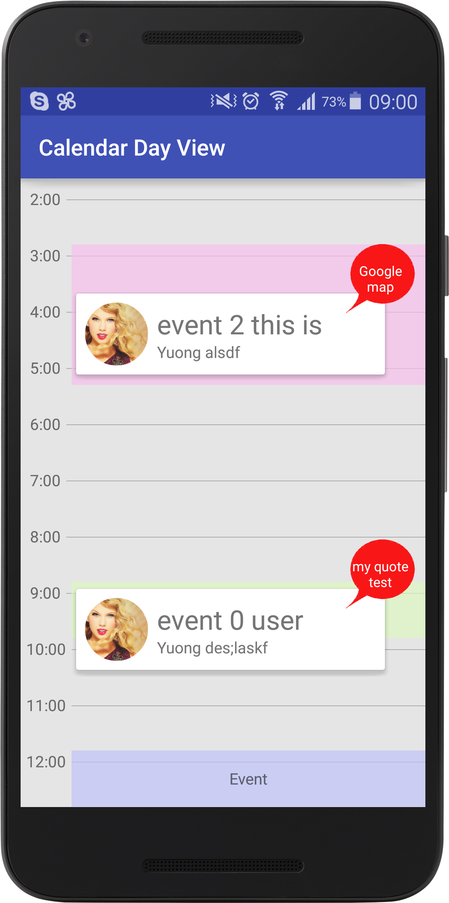

# Calendar-Day-View
Calendar Day View

<a></a>

#### install:

````Gradle
compile 'com.framgia.library.calendardayview:library:1.0.2'
````

#### How to use:

````xml
<!-- If you want the calendar scrollable -->
<ScrollView
      android:layout_width="match_parent"
      android:layout_height="match_parent"
      >
      <com.framgia.library.calendardayview.CalendarDayView
          android:id="@+id/dayView"
          android:layout_width="match_parent"
          android:layout_height="wrap_content"
          app:eventPaddingLeft="10dp"
          app:dayHeight="@dimen/dayHeight"/>
  </ScrollView>
````

Create your model [Event.java](https://github.com/khacpv/Calendar-Day-View/blob/master/sample/src/main/java/com/framgia/sample/calendardayview/Event.java#L11) class by implement IEvent & IPopupEvent

````Java
Event implements IEvent, IPopupEvent {

    @Override
    public IPopupEvent getPopup() {...}
    
    ...
}
````

See [MainActivity.java](https://github.com/khacpv/Calendar-Day-View/blob/master/sample/src/main/java/com/framgia/sample/calendardayview/MainActivity.java) to know how to add events into calendar-day-view

````Java
{
      int eventColor = getResources().getColor(R.color.eventColor4);
      Calendar timeStart = Calendar.getInstance();
      timeStart.set(Calendar.HOUR_OF_DAY,16);
      timeStart.set(Calendar.MINUTE,15);
      Calendar timeEnd = (Calendar) timeStart.clone();
      timeEnd.add(Calendar.HOUR_OF_DAY, 1);
      timeEnd.add(Calendar.MINUTE,30);
      Event event = new Event(3, timeStart, timeEnd, "event 6", "house", eventColor);
      event.setBitmap(BitmapFactory.decodeResource(getResources(),R.drawable.avatar));
      event.setTitle("event 2 this is test");
      event.setDescription("Yuong alsdf");
      event.setQuote("Google map");
      events.add(event);
  }

  CalendarDayView.setEvents(events);
````
